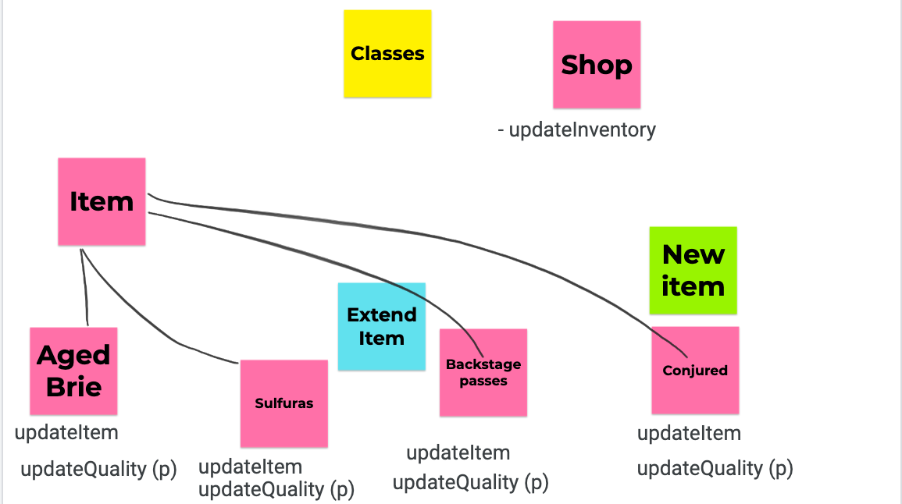
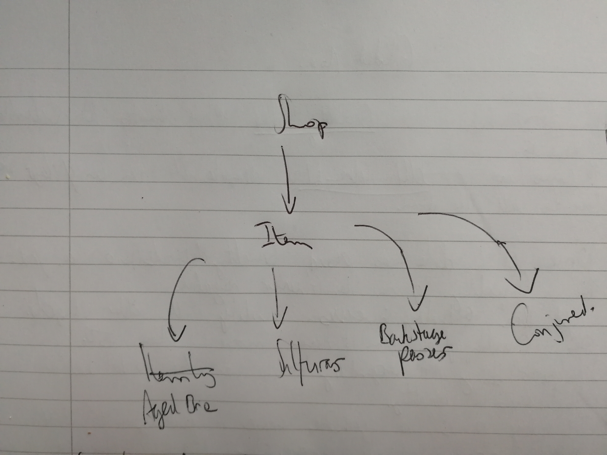

# Gilded Rose (Makers Academy week 10)

This Kata was originally created by Terry Hughes (http://twitter.com/TerryHughes). It is already on GitHub here. See also Bobby Johnson's description of the kata.

## The brief

Choose legacy code (translated by Emily Bache) in the language of your choice. The aim is to practice good design in the language of your choice. Refactor the code in such a way that adding the new "conjured" functionality is easy.

## Usage

### How to run program:

```
const brie = new Brie('Aged Brie', 10, 10);
const backStagePass = new BackStagePass('Music Concert', 10, 10);
const standardItem = new StandardItem('Pears', 10, 10);
const sulfura = new Sulfura('sulfura', 'n/a', 10);
const items = [brie, backStagePass, standardItem, sulfura];
gildedRose = new Shop(items);
gildedRose.updateStock();
```

### How to run tests:

```
jasmine
```

### Planning diagram:



I used Jamboard to model the program. Having initially been unsure about how best to extend the Item class, I ended up sticking quite closely to the initial JamBoard diagram.

## Planning diagram v2:



## Approach

- I wrote out all of the requirements of the program to familiarise myself with the task at hand. I then put the `Item` class into a separate file, ready to begin the TDD process.
- I decided to tackle one item group at a time and began writing tests for the `BrieItem` class which extends the original `Item` class.
- Once I had tested all of the logic for the `BrieItem` class, I replicated what I had done here for the other classes, again extending the `Item` class each time.
- Once I had finished TDD of the item group classes, I wrote a test for the original `Shop` class to ensure that it calls the correct method for each item in the shop.
- Once I was happy with this test, I was able to remove most of the original legacy code from the `Shop` class except for the 'for loop' and one method call within it.
- I then added a `ConjuredItems` class.
- The final stage of the task was refactoring, and improving the robustment of my tests. This included adding in some feature tests.
